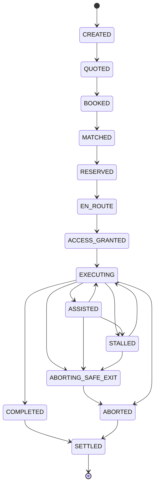

# Job State Machine (v0.6)

Jobs are explicit workflows. Every transition emits an event; the event log is replayable.

## States

- `CREATED`
- `QUOTED`
- `BOOKED`
- `MATCHED`
- `RESERVED`
- `EN_ROUTE`
- `ACCESS_GRANTED`
- `EXECUTING`
- `ASSISTED` (sub-state during execution)
- `STALLED` (execution liveness failure)
- `ABORTING_SAFE_EXIT` (forced by access revoke/expiry)
- `COMPLETED`
- `ABORTED`
- `SETTLED`

## Terminality

- Terminal execution: `COMPLETED` or `ABORTED`
- Terminal financial: `SETTLED`

## Diagram (simplified)

## Policy hooks

- Access revocation at any time → agent must transition to safe exit behavior (recorded as events).
- Missing heartbeats → server appends `JOB_EXECUTION_STALLED` and escalates per tier/coverage policy.
- Jobs can be rescheduled via `JOB_RESCHEDULED`, which resets dispatch and clears access planning.
- Incidents/claims can occur in parallel; they do not necessarily change the main job status (modeled as parallel tracks in the event log).
